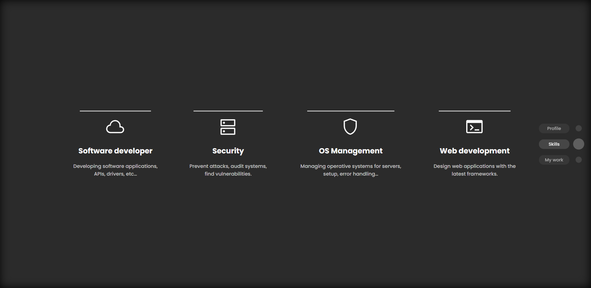
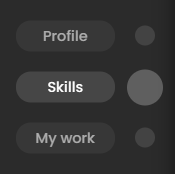

# BubbleScrollBar documentation

This tool allow the user to create a custom scrollbar for any site, the tool will remove the default scrollbar and it will be replaced with a fixed element placed at the right side of the screen.




# Implementation

Just add the component to your JSX code and the element will be positioned as *fixed* in the right side of the screen

*Import library*
```javascript
import BubbleScrollBar from "./BubbleScrollBar/BubbleScrollBar"
```
*Add component*
```jsx
<BubbleScrollBar sections={sectionsData}/>
```

# Props

> - `sections`  Takes an array of objects as show [here](#sections-object-structure)

## `sections` object structure

```javascript
{
    label: "Section name",
    id: "section--id"
}
```

> In the followig example we create an array of objects where the object is the data of each item of the TOC (Table Of Concepts) of the scrollbar

```javascript
const sectionsData = [
    {
        label: "Profile",
        id: "section--welcome"
    },
    {
        label: "Skills",
        id: "section--skills-wrap"
    },
    {
        label: "My work",
        id: "section--work"
    }
]
```

## Media

- **Zoomed screenshot**

